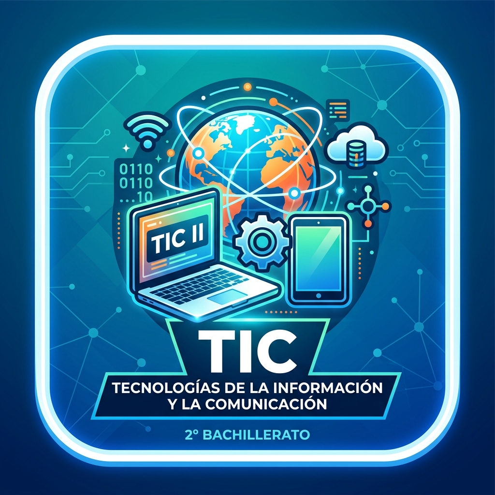

# Tecnologías de la Información y la Comunicación II — 2º Bachillerato

Bienvenido/a al sitio de consulta de la asignatura. Aquí encontrarás la teoría resumida y las prácticas paso a paso de cada unidad de trabajo.

## Sobre la asignatura

Esta materia proporciona al alumnado las competencias necesarias para generar contenido digital multimedia, digitalizar su propio entorno personal de aprendizaje y diseñar y desarrollar programas informáticos, lo que incluye:

- Crear y publicar sitios web avanzados con HTML5, CSS y JavaScript, alojándolos en servidores remotos.
- Publicar contenidos breves e interactivos en plataformas de microblogging.
- Trabajar en entornos colaborativos en la nube para crear contenido multimedia (presentaciones, documentos, audio y vídeo).
- Diseñar, crear y consultar bases de datos relacionales y no relacionales.
- Maquetar documentos de comunicación eficaz con software de escritorio.
- Desarrollar aplicaciones de realidad virtual y aumentada.
- Programar en Python aplicando principios de pensamiento computacional.

Esta asignatura desarrolla las siguientes competencias específicas:

- **CE1.** Generar contenido digital multimedia con alto potencial de difusión y de experiencia de usuario.
- **CE2.** Configurar el entorno personal de aprendizaje, aprovechando la variedad de recursos del ámbito digital.
- **CE3.** Diseñar e implementar programas informáticos que automaticen soluciones a problemas previamente definidos.

## Unidades de Trabajo

1. [Diseño de páginas Web — HTML5, CSS y JavaScript](ut1-html-css-js/index.md) *(1er trimestre)*
2. [Microblogging](ut2-microblogging/index.md) *(1er trimestre)*
3. [Multimedia](ut3-multimedia/index.md) *(1er trimestre)*
4. [Bases de datos](ut4-bases-datos/index.md) *(2º trimestre)*
5. [Maquetación avanzada](ut5-maquetacion/index.md) *(2º trimestre)*
6. [Realidad virtual, aumentada y mixta](ut6-realidad-virtual/index.md) *(2º trimestre)*
7. [Programación en Python](ut7-python/index.md) *(3er trimestre)*

> Las entregas y tareas evaluables se gestionan desde **Microsoft Teams**. Este sitio es solo material de consulta.
