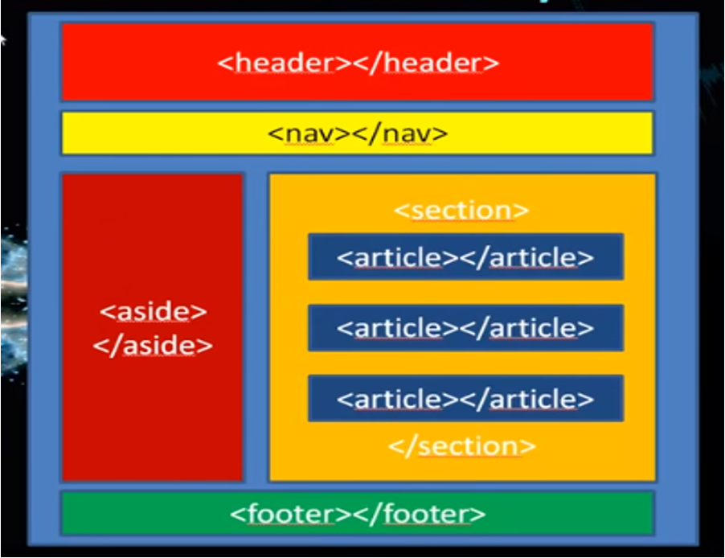

# HTML5 — Estructura y contenido

**HTML** (*HyperText Markup Language*, Lenguaje de Marcas de Hipertexto) es un lenguaje de marcado que se utiliza para el desarrollo de páginas web. Su origen se remonta a 1980, cuando Tim Berners-Lee, físico del CERN, propuso un sistema de "hipertexto" para compartir documentos. La esencia de HTML reside en el concepto de **etiquetas**: encapsulamos el contenido dentro de etiquetas determinadas, cada una con un cometido específico.

HTML no es un lenguaje de programación: describe **qué es** cada parte del contenido (un título, un párrafo, una imagen...), no cómo se comporta ni cómo se ve (de eso se encargan JavaScript y CSS respectivamente). Precisamente por eso HTML tiene limitaciones: no soporta tareas de impresión y diseño, sus etiquetas son limitadas, no permite mostrar contenido dinámico por sí solo, y mezcla estructura y diseño si no se apoya en CSS.

### Editores de código

Para escribir HTML se puede usar cualquier editor de texto, pero un **editor de código** facilita mucho el trabajo gracias a funciones como el resaltado de sintaxis (colorea etiquetas y texto para facilitar la lectura), el autocompletado (sugiere y cierra etiquetas automáticamente) y la detección de errores (marca etiquetas sin cerrar u otros fallos de sintaxis). Los más habituales son **Visual Studio Code**, **Sublime Text**, **Notepad++** y **Brackets**.

## Estructura básica de un documento

Todo documento HTML debe tener siempre una estructura, con algunas etiquetas obligatorias y otras recomendables. Se distinguen 3 zonas principales:

```html
<!DOCTYPE html>
<html lang="es">
  <head>
    <meta charset="UTF-8">
    <title>Título de la página</title>
  </head>
  <body>
    <!-- Aquí va el contenido visible de la página -->
  </body>
</html>
```

- `<!DOCTYPE html>`: en la primera línea del documento debe ir especificado siempre de qué tipo de documento HTML se trata. No es absolutamente obligatorio indicarlo, pero sí recomendable. En HTML5 basta con `<!DOCTYPE html>`; en versiones anteriores, como HTML4, esta línea era mucho más compleja.
- `<html>`: elemento raíz que engloba todo el documento.
- `<head>`: primera sección del documento, donde se especifican todos los metadatos, es decir, la parte "que no se ve" directamente en el navegador.
- `<body>`: segunda sección, el cuerpo de la página, donde sí aparecen todos los elementos que se muestran visualmente al usuario.

### Elementos del `<head>`

- `<meta charset="UTF-8">`: fija la codificación de caracteres (necesaria para que las tildes y la ñ se muestren bien).
- `<meta name="description" content="...">`: breve descripción de la página, usada por los buscadores.
- `<meta name="viewport" content="width=device-width, initial-scale=1.0">`: adapta la página a dispositivos móviles.
- `<title>`: texto que aparece en la pestaña del navegador.

### Comentarios

Con `<!--` y `-->` se escriben comentarios que el navegador no tiene en cuenta como código: solo tienen repercusión a nivel de quien programa, para dejar notas.

```html
<!-- Esto es un comentario en HTML5 -->
<p>Esto es un párrafo HTML</p>
<!-- Esto es otro comentario en HTML5 -->
```

### Caracteres especiales

Algunos caracteres (como `<`, `>`, `&`, o los propios de nuestro idioma: la ñ y las vocales acentuadas) conviene escribirlos mediante su **entidad HTML** para evitar problemas de codificación:

| Entidad | Carácter | | Entidad | Carácter |
|---|---|---|---|---|
| `&lt;` | `<` | | `&ntilde;` | ñ |
| `&gt;` | `>` | | `&Ntilde;` | Ñ |
| `&amp;` | `&` | | `&aacute;` | á |
| `&nbsp;` | espacio irrompible | | `&eacute;` | é |
| `&copy;` | © | | `&iacute;` | í |
| `&euro;` | € | | `&oacute;` / `&Oacute;` | ó / Ó |

## Organización semántica del `<body>`

HTML5 incorpora etiquetas **semánticas** para organizar el cuerpo de la página, es decir, etiquetas que describen el significado de cada parte además de estructurarla. Esta es la organización típica de una página:



- `<header>`: cabecera de la página o de una sección. Se escribe justo debajo de `<body>`.
- `<nav>`: bloque de navegación (menú de enlaces). Se escribe debajo de `<header>`.
- `<aside>`: barra lateral, con información secundaria o complementaria; puede ir a cualquier lado. Se escribe debajo de `<nav>`.
- `<section>`: agrupación de contenido relacionado; es donde va el contenido principal e importante de la página. Se escribe a continuación de `<aside>`.
- `<article>`: contenido independiente y autocontenido (una noticia, una entrada de blog...). Se usa para agrupar varios artículos de contenido similar dentro de una `<section>`.
- `<main>`: contenedor único para englobar la parte principal de la página.
- `<footer>`: pie de página, donde suele figurar información legal o de contacto. Se escribe a continuación de `<section>`.

```html
<body>
  <header>
    <h1>Título de la web</h1>
  </header>
  <nav>
    <ul>
      <li>Quiénes somos</li>
      <li>Nuestros productos</li>
      <li>Contáctanos</li>
    </ul>
  </nav>
  <aside>
    <blockquote>Una cita destacada</blockquote>
  </aside>
  <section>
    <article>Noticia 1</article>
    <article>Noticia 2</article>
  </section>
  <footer>
    Derechos reservados. Tfno: 000000000
  </footer>
</body>
```

Probar `<header>` con las etiquetas `<h1>` a `<h6>` (jerarquía de título) ayuda a que su contenido se visualice correctamente en todos los dispositivos.

## Etiquetas de texto

En un documento HTML existen dos tipos de etiquetas: las que contienen **fragmentos de texto** (para resaltar, enfatizar o dar significado a una parte concreta) y las que **agrupan conjuntos de información** (ver siguiente apartado). Por ejemplo, en `<p>Hola, esto es un pequeño <strong>ejemplo</strong>.</p>`, `<p>` agrupa y `<strong>` marca un fragmento.

Etiquetas para fragmentos de texto:

| Etiqueta | Descripción |
|---|---|
| `<strong>` | Fragmento de texto importante o palabras clave |
| `<em>` | Fragmento de texto enfatizado respecto a la frase que lo contiene |
| `<mark>` | Fragmento de texto resaltado, como marcado con rotulador |
| `<i>` | Fragmento de texto con voz o tono alternativo al resto |
| `<b>` | Fragmento de texto sin importancia destacable (fines utilitarios) |
| `<u>` | Fragmento de texto para nombres propios o escritura incorrecta intencionada |
| `<s>` | Fragmento de texto inexacto o que ya no es relevante |
| `<span>` | Fragmento de texto sin significado (útil para seleccionar y aplicar estilos) |
| `<cite>` | Fragmento de texto con el título de un trabajo creativo: obras, libros... |

Etiquetas de modificación de significado:

| Etiqueta | Atributos | Descripción |
|---|---|---|
| `<sup>` | | Superíndice (24<sup>2</sup>) |
| `<sub>` | | Subíndice (24<sub>2</sub>) |
| `<small>` | | Anotaciones menores, pequeñas puntualizaciones |
| `<q>` | `cite` | Cita o frase extraída de otro contexto |
| `<dfn>` | `title` | Definición (término que posteriormente será definido) |
| `<abbr>` | `title` | Abreviatura o acrónimo |

Etiquetas orientadas a aspectos informáticos:

| Etiqueta | Atributos | Descripción |
|---|---|---|
| `<kbd>` | | Entrada de información del usuario (combinación de teclado) |
| `<samp>` | | Salida de información de un programa informático |
| `<var>` | | Variable (contexto matemático o informático) |
| `<time>` | `datetime` | Fecha/hora legible para humanos, con formato para máquinas |
| `<data>` | `value` | Información equivalente orientada a máquinas |
| `<code>` | | Fragmento de código fuente (en línea) |

Etiquetas de encabezado y salto de línea:

- `<h1>` a `<h6>`: encabezados, de mayor a menor importancia.
- `<p>`: párrafo.
- `<br>`: salto de línea (nueva línea). No necesita etiqueta de cierre.
- `<wbr>`: oportunidad de salto de línea (división silábica con guion). Tampoco necesita etiqueta de cierre.

## Etiquetas de agrupación

Además de las etiquetas para fragmentos de texto, existen etiquetas para agrupar y organizar otras etiquetas:

| Etiqueta | Atributos | Descripción |
|---|---|---|
| `<div>` | | Capa o división utilizada para agrupar varias etiquetas HTML (contenedor de **bloque** genérico, sin significado semántico propio) |
| `<p>` | | Define un párrafo de texto (con sus etiquetas HTML para texto) |
| `<pre>` | | Establece un texto preformateado (respeta espacios y saltos de línea; ideal para código) |
| `<blockquote>` | `cite` | Agrupa información y características de una cita (autor, fuente...) |
| `<main>` | | Contenedor para englobar la parte principal de la página |
| `<hr>` | | Indica una separación temática del texto |

`<span>`, visto en la tabla de fragmentos de texto, es el equivalente **en línea** a `<div>`: se usa para aplicar estilos a una parte concreta de un texto sin romper el flujo del párrafo ni crear un salto de línea.

## Listas

```html
<!-- Lista no ordenada -->
<ul>
  <li>HTML</li>
  <li>CSS</li>
  <li>JavaScript</li>
</ul>

<!-- Lista ordenada -->
<ol>
  <li>Primero</li>
  <li>Segundo</li>
</ol>

<!-- Lista de definiciones -->
<dl>
  <dt>FTP</dt>
  <dd>Protocolo de transferencia de archivos, usado para publicar una web en un servidor remoto.</dd>
</dl>
```

`<ol>` admite además los atributos `start` (número por el que empieza a contar la lista), `reversed` (numera en orden inverso) y `type` (números, letras o números romanos, en mayúsculas o minúsculas).

## Imágenes

```html

```

- `src`: indica el nombre o la URL de la imagen a mostrar.
- `alt`: texto alternativo para mostrar en caso de que la imagen no se pueda cargar (accesibilidad y SEO).
- `width` / `height`: ancho y alto de la imagen. No se debe indicar la unidad; se aconseja fijar el tamaño desde CSS en su lugar.

## Enlaces (hipervínculos)

La etiqueta `<a>` (*anchor*) se utiliza para crear hipervínculos. Su atributo principal es `href`, que indica la dirección a la que lleva el enlace (una página web, un correo, un archivo o un ancla interna):

```html
<a href="https://www.ejemplo.com">Visita el ejemplo</a>
<a href="pagina.html">Enlace interno</a>
<a href="#seccion2">Enlace a un ancla dentro de la misma página</a>
<a href="mailto:correo@ejemplo.com">Enviar correo</a>
<a href="archivo.pdf" download>Descargar archivo</a>
<a href="https://www.ejemplo.com" target="_blank">Abrir en pestaña nueva</a>
```

El atributo `target` define dónde se abrirá el enlace: `_self` (valor por defecto, misma pestaña), `_blank` (nueva pestaña), y también `_parent` / `_top` en páginas con marcos anidados.

## Tablas

```html
<table border="1">
  <caption>Tabla 1. Título de la tabla</caption>
  <thead>
    <tr><th>Tienda 1</th><th>Tienda 2</th></tr>
  </thead>
  <tbody>
    <tr><td>1200€</td><td>1100€</td></tr>
  </tbody>
</table>
```

- `<table>`: etiqueta contenedora que tendrá en su interior toda la tabla (atributo `border` para el grosor del borde).
- `<caption>`: título de la tabla (debe ser el primer elemento dentro de `<table>`).
- `<tr>` (*table row*): fila.
- `<td>` (*table data*): cada una de las celdas de la tabla.
- `<th>` (*table header*): cada una de las celdas de cabecera.
- `<thead>`, `<tbody>`, `<tfoot>`: agrupan las filas de cabecera, cuerpo y pie de la tabla.
- `rowspan` / `colspan`: combinan celdas en varias filas o columnas.
- `bgcolor`: color de fondo de la tabla o de una celda.
- `align` (horizontal: `left` / `center` / `right`) y `valign` (vertical: `top` / `middle` / `bottom`): alinean el contenido dentro de las celdas.

Las tablas **no deben usarse como herramienta de maquetación** de la página; su uso correcto es mostrar datos tabulares.

## Multimedia

### Vídeo

```html
<video width="640" height="480" controls>
  <source src="video.mp4" type="video/mp4">
  <source src="video.ogg" type="video/ogg">
  Tu navegador no soporta la etiqueta video.
</video>
```

### Audio

```html
<audio controls>
  <source src="audio.mp3" type="audio/mpeg">
  <source src="audio.ogg" type="audio/ogg">
  Tu navegador no soporta el elemento audio.
</audio>
```

Atributos principales de `<video>` y `<audio>`: `src` (ruta del archivo), `controls` (muestra los controles de reproducción), `autoplay` (reproduce automáticamente), `loop` (repite el archivo) y `muted` (comienza silenciado). El elemento `<source>` permite ofrecer el mismo archivo en varios formatos (`src` + `type`), para compatibilidad entre navegadores.

### Marcos (`iframe`)

El elemento `<iframe>` incrusta el contenido de otra página web dentro de la nuestra "en vivo" (por ejemplo, para embeber un vídeo de YouTube o un mapa):

```html
<iframe src="https://www.youtube.com/embed/XXXXXXXXXXX"
        width="560" height="315"
        title="Descripción del marco">
</iframe>
```

- `src`: URL de la página a mostrar.
- `width` / `height`: tamaño del marco.
- `title`: título accesible del marco.
- `name` + atributo `target` en un enlace: permite que un `<a>` cargue su destino dentro de un `<iframe>` concreto.

## Formularios

Los formularios (`<form>`) recogen datos de la persona usuaria y los envían a un programa del servidor.

```html
<form action="/procesar.php" method="post">
  <label for="nombre">Nombre:</label>
  <input type="text" id="nombre" name="nombre">

  <input type="radio" name="sexo" value="hombre" checked> Hombre
  <input type="radio" name="sexo" value="mujer"> Mujer

  <input type="submit" value="Enviar">
</form>
```

Atributos principales de `<form>`:

- `action`: dirección a la que se envían los datos.
- `method`: `get` (los datos viajan visibles en la URL) o `post` (los datos viajan de forma codificada, no visibles).
- `enctype`: cómo se codifican los datos al enviarlos con `post`.
- `target`: dónde se muestra la respuesta (`_blank`, `_self`, `_parent`, `_top`).

### El elemento `<input>` y su atributo `type`

| `type` | Uso |
|---|---|
| `text` | Caja de texto de una línea |
| `password` | Como `text`, pero oculta el valor introducido |
| `email`, `url`, `tel` | Validan correo, URL o teléfono |
| `number`, `range` | Valores numéricos (con o sin control deslizante) |
| `date`, `month`, `week`, `time`, `datetime-local` | Fechas y horas |
| `checkbox` | Casillas de selección múltiple (varias opciones a la vez) |
| `radio` | Botones de opción (una sola opción; mismo `name` en todo el grupo) |
| `file` | Selección de archivos |
| `color` | Selector de color |
| `hidden` | Campo oculto, no visible para el usuario |
| `submit` | Botón que envía el formulario |
| `reset` | Botón que restaura el formulario a sus valores por defecto |
| `image` | Botón de envío con imagen personalizada (`src`) |
| `button` | Botón sin comportamiento predefinido (se usa con JavaScript) |

Otros atributos útiles de `<input>`: `name` (identificador del campo), `value` (valor por defecto o texto del botón), `checked` (opción marcada por defecto), `size`/`maxlength` (tamaño y longitud máxima del texto), `disabled` (desactiva el control) y `autofocus` (el control recibe el foco al cargar la página).

### Otros controles del formulario

- `<textarea rows="4" cols="30"></textarea>`: caja de texto multilínea (`rows`, `cols`, `readonly`).
- `<select>` / `<option>`: lista desplegable de opciones (`size` para mostrar varias a la vez, `multiple` para selección múltiple); `<optgroup>` agrupa opciones relacionadas.
- `<datalist>`: sugerencias de autocompletado para un `<input>`.
- `<fieldset>` / `<legend>`: agrupan visualmente un conjunto de controles bajo un título.
- `<label for="id">`: asocia una etiqueta de texto a un control del formulario (mejora la accesibilidad).
- `<button>`: botón genérico, muy usado junto con JavaScript (`type="button"`, `type="submit"` o `type="reset"`).

```html
<button type="button" onclick="alert('Hola')">Púlsame</button>
```

---

[⬅ Volver a UT1](index.md) · [Ir a CSS](css.md) · [Ir a JavaScript](javascript.md) · [Ir a Publicación web avanzada](publicacion-web.md)
