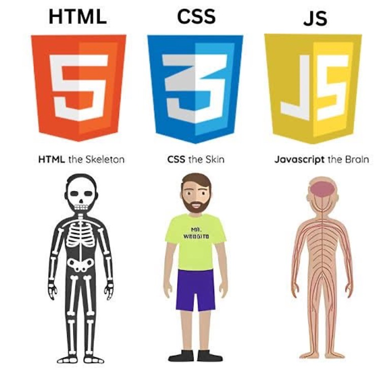

# UT1. Diseño de páginas Web con HTML5, CSS y JavaScript

Esta unidad de trabajo aborda las tres tecnologías básicas del desarrollo web del lado del cliente: **HTML5** para la estructura y el contenido, **CSS** para la presentación visual y **JavaScript** para la interactividad. Son la base sobre la que se construye cualquier página o aplicación web.

Una forma sencilla de recordar el papel de cada tecnología: **HTML es el esqueleto** (la estructura), **CSS es la piel** (el aspecto visual) y **JavaScript es el cerebro** (el comportamiento e interactividad).

## Contenidos

1. [HTML5 — Estructura y contenido](html.md)
2. [CSS — Estilos y maquetación](css.md)
3. [JavaScript — Interactividad](javascript.md)
4. [Publicación web avanzada — Widgets, FTP y Geolocalización](publicacion-web.md)

## Qué vas a aprender

- Escribir la estructura de un documento HTML5 válido: cabecera, metadatos, texto, listas, imágenes, enlaces, tablas, elementos multimedia y formularios.
- Aplicar estilos con CSS mediante los tres métodos (en línea, interno y externo), utilizar selectores, y controlar colores, tipografía, el modelo de caja y el posicionamiento de los elementos.
- Incorporar comportamiento dinámico con JavaScript: variables, tipos de datos, operadores, estructuras de control y ventanas emergentes.
- Combinar las tres tecnologías para crear una página web completa, semántica y funcional.
- Integrar widgets externos, publicar un sitio en un servidor remoto mediante FTP, y usar la API de Geolocalización de HTML5.

> Las prácticas guiadas y las actividades evaluables de esta unidad se gestionan desde **Microsoft Teams**. Esta página es solo material de consulta (teoría resumida).

[⬅ Volver al inicio](../index.md)
