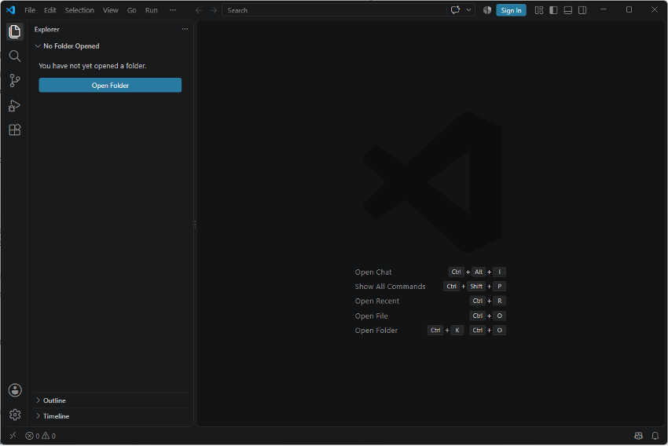
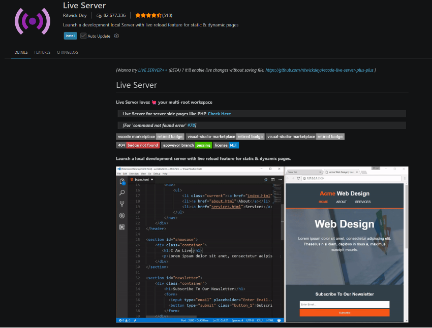
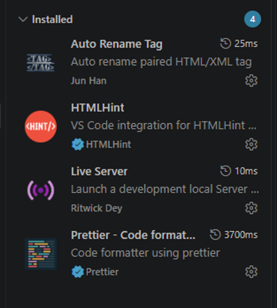

# Instalación y configuración de Visual Studio Code

En esta unidad vamos a escribir todo el código —HTML, y más adelante CSS y JavaScript— con **Visual Studio Code**. Antes de empezar con las [Prácticas de HTML5](practicas-html.md), sigue esta guía para instalarlo y dejarlo configurado.

## 1. Descargar e instalar Visual Studio Code

1. Entra en [code.visualstudio.com](https://code.visualstudio.com/) y pulsa el botón de descarga para tu sistema operativo (en los equipos del aula, Windows).
2. Ejecuta el instalador descargado (`VSCodeUserSetup-...exe`) y acepta la licencia.
3. En la pantalla de "Tareas adicionales", marca al menos estas opciones, porque facilitan mucho el uso diario:
   - **Añadir a PATH** (para poder abrir VS Code escribiendo `code` en una terminal).
   - **Añadir la acción "Abrir con Code" al menú contextual de archivos y carpetas** del explorador de Windows.
4. Termina la instalación y abre VS Code.

## 2. Primer inicio: abrir tu carpeta de trabajo

Al abrir VS Code por primera vez verás el panel *Explorer* con el mensaje **"No Folder Opened"** (ninguna carpeta abierta), como en la imagen:

A diferencia de otros editores, VS Code trabaja siempre sobre una **carpeta**, no sobre archivos sueltos. Antes de escribir el primer ejercicio:

1. Crea (o localiza) la carpeta donde vas a guardar todos los ejercicios de esta unidad, por ejemplo `ejercicios-html`.
2. En VS Code, pulsa el botón **Open Folder** (o el atajo `Ctrl + K`, `Ctrl + O`) y selecciona esa carpeta.
3. A partir de ahora, cada vez que abras VS Code para trabajar en la asignatura, abre esa misma carpeta con **File → Open Recent**.

## 3. Instalar las extensiones necesarias

Abre la vista de extensiones desde el icono de piezas de puzle de la barra lateral, o con `Ctrl + Shift + X`, y busca e instala estas cuatro:

| Extensión | Para qué sirve |
|---|---|
| **Live Server** | Abre tu página en el navegador y la recarga sola cada vez que guardas. |
| **Auto Rename Tag** | Al cambiar una etiqueta de apertura, renombra automáticamente su etiqueta de cierre. |
| **HTMLHint** | Avisa de errores comunes: etiquetas sin cerrar, atributos `alt` que faltan, ids duplicados... |
| **Prettier - Code formatter** | Ordena e indenta el código automáticamente al guardar. |

Busca cada nombre en el cuadro de búsqueda y pulsa **Install**. Así se ve la ficha de Live Server en el Marketplace, con el botón de instalación:

Cuando termines, comprueba en el panel de extensiones instaladas que tienes las cuatro, como en esta captura:

> **Extensiones opcionales.** Si quieres ir más allá, puedes instalar también **Error Lens** (muestra los avisos de HTMLHint directamente en la línea de código), **Code Spell Checker** con el diccionario en español (corrige erratas en textos y comentarios) y el **Spanish Language Pack** (traduce la interfaz de VS Code). No son obligatorias para las prácticas.

## 4. Configurar Prettier como formateador por defecto

Para que el código se ordene solo al guardar:

1. Abre los ajustes con `Ctrl + ,`.
2. Busca `default formatter` y elige **Prettier - Code formatter**.
3. Busca `format on save` y marca la casilla **Editor: Format On Save**.

Desde ahora, cada vez que guardes un archivo (`Ctrl + S`), VS Code lo indentará automáticamente.

## 5. Ver tu página con Live Server

Cuando tengas un archivo `index.html`:

- Haz clic derecho sobre el archivo, en el panel *Explorer*, y elige **Open with Live Server**;
- o pulsa el botón **Go Live** que aparece abajo a la derecha, en la barra de estado.

Se abrirá una pestaña del navegador con tu página, que se recargará sola cada vez que guardes cambios. Es la forma en la que vas a comprobar todos los ejercicios de esta unidad.

## Checklist final

- [ ] VS Code instalado
- [ ] Carpeta de trabajo de la asignatura creada y abierta con *Open Folder*
- [ ] Las cuatro extensiones instaladas: Live Server, Auto Rename Tag, HTMLHint, Prettier
- [ ] Prettier configurado como formateador por defecto y *Format On Save* activado
- [ ] Live Server probado sobre un `index.html` y funcionando

---

[⬅ Volver a UT1](index.md) · [Ir a HTML5](html.md) · [Ir a Prácticas de HTML5](practicas-html.md) · [Ir a CSS](css.md) · [Ir a JavaScript](javascript.md) · [Ir a Publicación web avanzada](publicacion-web.md)