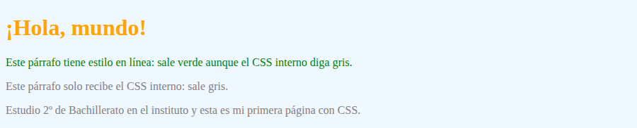
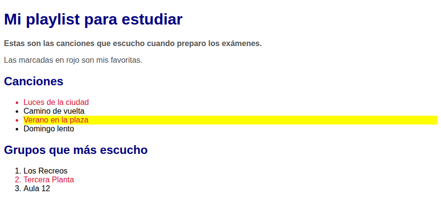
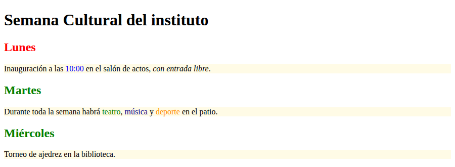
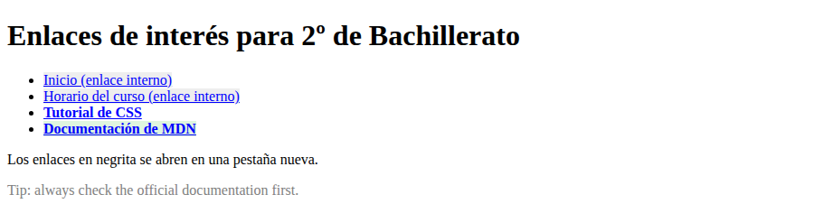
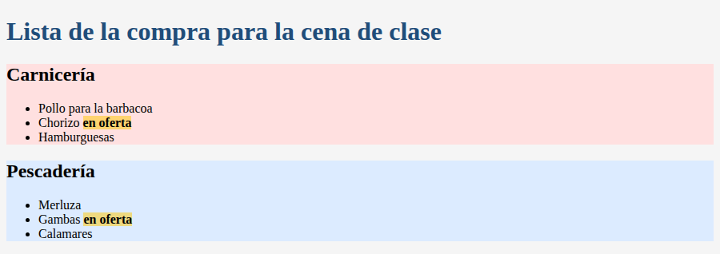
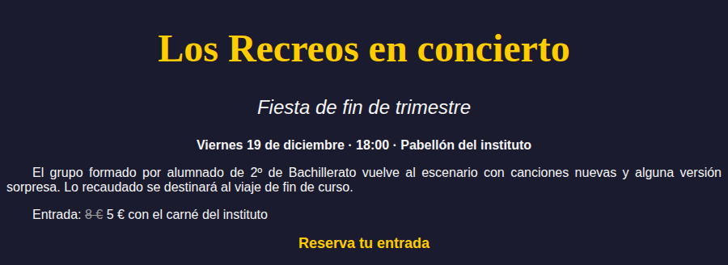
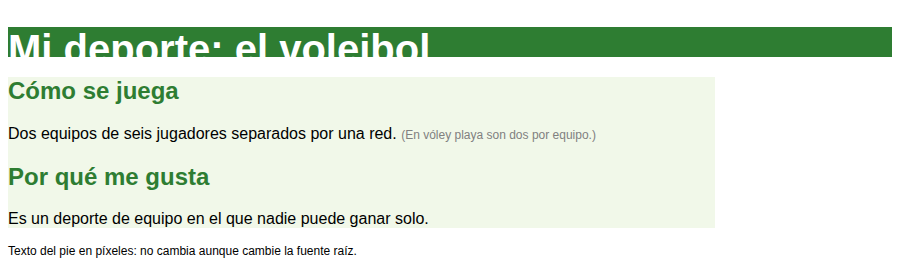
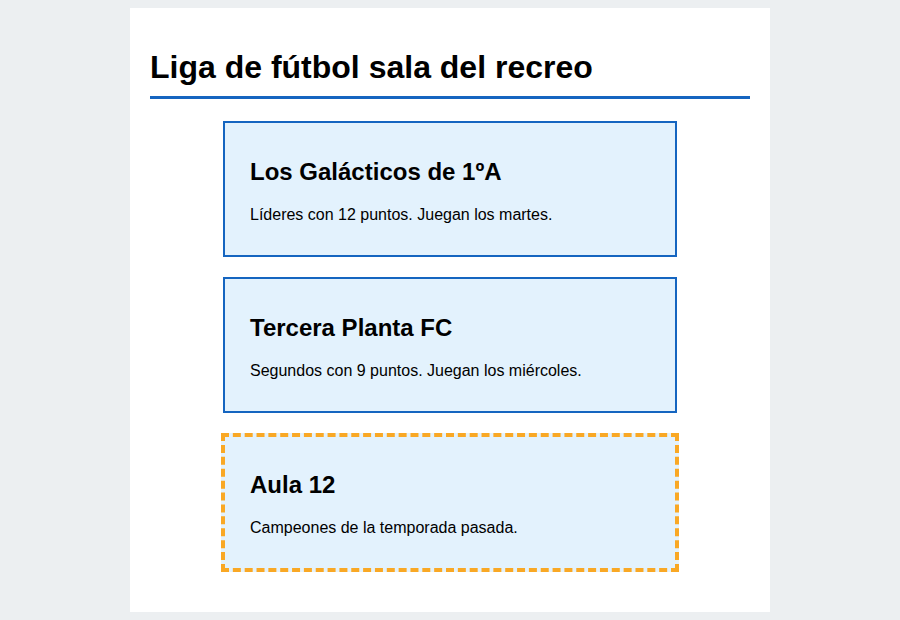
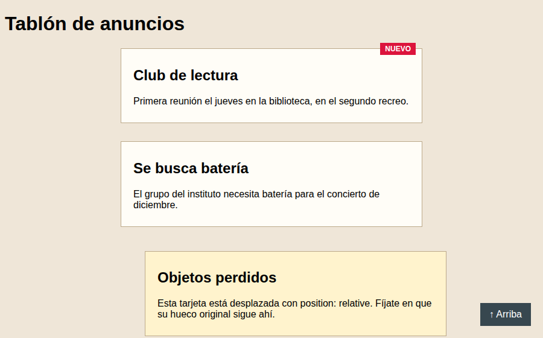
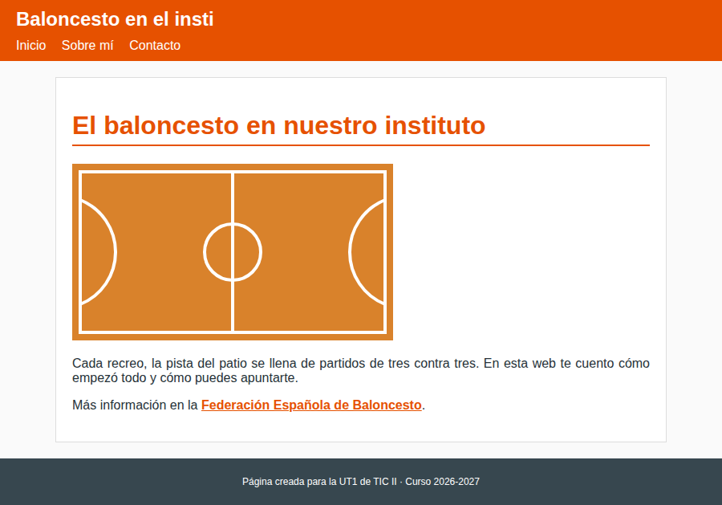

# Prácticas de CSS

Esta página recoge los ejercicios para aplicar, paso a paso, lo visto en [CSS — Estilos y maquetación](css.md). Siguen el mismo orden que los apuntes: empiezan por cómo enlazar una hoja de estilos y terminan con el modelo de caja y el posicionamiento. El último ejercicio es una síntesis: darás estilo al mini-sitio que creaste en el ejercicio 9 de las [prácticas de HTML5](practicas-html.md).

## Antes de empezar

Cada ejercicio va en **su propia carpeta** dentro de `ejercicios-css/` de tu repositorio, con esta estructura:

```
ejercicios-css/
└── ej01-formas-css/
    ├── index.html
    └── css/
        └── estilos.css
```

- **Ejercicios 1 y 10:** escribes tú todo el HTML.
- **Ejercicios 2 a 9:** tienes un **HTML de partida** en el enunciado. Crea el `index.html`, copia dentro el código tal cual y crea `css/estilos.css` vacío. El HTML ya trae el `<link>` a la hoja de estilos. En los ejercicios 2, 3, 4 y 9 tendrás que añadirle clases, `id`, atributos o `span`: los pasos te dicen cuáles.
- En el ejercicio 1 enlazarás tú la hoja desde el `<head>` con `<link rel="stylesheet" href="css/estilos.css">`.
- Abre `index.html` con **Live Server** para ver los cambios al guardar.
- Cuando algo no se aplique, pulsa **F12** e inspecciona el elemento: el navegador te dice qué regla se aplica y cuál está tachada (sobrescrita).
- Al terminar cada ejercicio, haz *commit* y *push* (sigue la guía [Subir tus ejercicios a GitHub](github.md)).

| Nº | Ejercicio | Contenido de los apuntes |
|---|---|---|
| 1 | Hola, mundo con estilo | Formas de aplicar CSS y prioridad |
| 2 | Mi playlist | Selectores básicos |
| 3 | Semana Cultural | Selectores de relación y combinación |
| 4 | Enlaces de interés | Selectores de atributo y pseudoclases |
| 5 | Lista de la compra | `div`, `span`, colores y fondos |
| 6 | Cartel de un concierto | Tipografía y texto |
| 7 | Mi deporte | Unidades de medida |
| 8 | Liga del recreo | Modelo de caja |
| 9 | Tablón de anuncios | Posicionamiento |
| 10 | Mi web con estilo | Síntesis de todo lo anterior |

---

## Ejercicio 1 — Hola, mundo con estilo

**Objetivo:** aplicar CSS de las tres formas posibles (en línea, interno y externo) y comprobar cuál tiene prioridad.

**Pasos:**

1. Crea la carpeta `ej01-formas-css/` con un `index.html` válido (`lang="es"`, `charset` UTF-8 y `<title>`). En el `<body>` escribe un `<h1>` con «¡Hola, mundo!» y **tres párrafos** en los que te presentes.
2. **En línea:** al primer párrafo ponle `style="color: green;"`.
3. **Interno:** añade en el `<head>` un bloque `<style>` que ponga los `h1` en naranja y todos los `p` en gris.
4. **Externo:** crea `css/estilos.css` con un color de fondo para `body` (el que quieras) y los `h1` en azul. Enlázala con `<link>` **antes** del `<style>`.
5. Observa de qué color sale el `h1`. Ahora mueve el `<link>` **debajo** del `<style>` y vuelve a mirar. Deja el `<link>` otra vez arriba.
6. Escribe al final del `<body>` un comentario HTML que explique:
   - de qué color sale el `h1` en cada caso y por qué;
   - por qué el primer párrafo sale verde aunque el CSS interno diga gris.

**Resultado esperado:** fondo de color en toda la página, título naranja (azul si el `<link>` va después del `<style>`), el primer párrafo verde y los otros dos grises.



**Entrega:** `ejercicios-css/ej01-formas-css/` (`index.html` + `css/estilos.css`).

---

## Ejercicio 2 — Mi playlist

**Objetivo:** usar los selectores básicos (universal, de tipo, de id, de clase y la unión de selectores) y aplicar dos clases a un mismo elemento.

**HTML de partida:** crea la carpeta `ej02-selectores-basicos/` y copia este código en su `index.html`. Puedes cambiar los textos por tu propia música. Crea también `css/estilos.css`, de momento vacío.

```html
<!DOCTYPE html>
<html lang="es">
<head>
  <meta charset="UTF-8">
  <meta name="viewport" content="width=device-width, initial-scale=1.0">
  <title>Ejercicio 2 — Mi playlist</title>
  <link rel="stylesheet" href="css/estilos.css">
</head>
<body>
  <h1>Mi playlist para estudiar</h1>
  <p>Estas son las canciones que escucho cuando preparo los exámenes.</p>
  <p>Las marcadas en rojo son mis favoritas.</p>

  <h2>Canciones</h2>
  <ul>
    <li>Luces de la ciudad</li>
    <li>Camino de vuelta</li>
    <li>Verano en la plaza</li>
    <li>Domingo lento</li>
  </ul>

  <h2>Grupos que más escucho</h2>
  <ol>
    <li>Los Recreos</li>
    <li>Tercera Planta</li>
    <li>Aula 12</li>
  </ol>
</body>
</html>
```

**Pasos:**

1. En el HTML, añade `id="intro"` al primer párrafo.
2. Marca con `class="favorita"` al menos **dos** canciones y **un** grupo.
3. A una de las canciones favoritas ponle **dos clases**: `class="favorita nueva"`.
4. En `css/estilos.css`, escribe una regla para cada selector:
   - **universal** (`*`): una tipografía para toda la página;
   - **de tipo**: un color para todos los párrafos;
   - **unión**: el mismo color para `h1` y `h2` en una sola regla;
   - **de id**: el párrafo `#intro` en negrita (`font-weight: bold`);
   - **de clase**: las `.favorita` en rojo;
   - **segunda clase**: `.nueva` con un color de fondo llamativo.

**Resultado esperado:** títulos del mismo color, el primer párrafo en negrita y los elementos favoritos en rojo, tanto en la lista de canciones como en la de grupos. La canción con las dos clases sale en rojo y además con fondo de color.



**Entrega:** `ejercicios-css/ej02-selectores-basicos/`.

**Ampliación opcional:** añade una tercera lista y comprueba que `.favorita` funciona en ella sin escribir ninguna regla nueva.

---

## Ejercicio 3 — Semana Cultural

**Objetivo:** diferenciar los selectores de relación (descendiente, hijo directo, hermano adyacente y hermanos en general) y combinar etiqueta y clase en un mismo selector.

**HTML de partida:** crea la carpeta `ej03-selectores-relacion/`, copia este código en su `index.html` y crea `css/estilos.css` vacío.

```html
<!DOCTYPE html>
<html lang="es">
<head>
  <meta charset="UTF-8">
  <meta name="viewport" content="width=device-width, initial-scale=1.0">
  <title>Ejercicio 3 — Semana Cultural</title>
  <link rel="stylesheet" href="css/estilos.css">
</head>
<body>
  <h1>Semana Cultural del instituto</h1>
  <h2>Lunes</h2>
  <p>Inauguración a las 10:00 en el salón de actos, con entrada libre.</p>
  <h2>Martes</h2>
  <p>Durante toda la semana habrá teatro, música y deporte en el patio.</p>
  <h2>Miércoles</h2>
  <p>Torneo de ajedrez en la biblioteca.</p>
</body>
</html>
```

**Pasos:**

1. En el párrafo del lunes, mete la hora en un `<span>` y el final de la frase en un `<em>` con otro `<span>` dentro. Tiene que quedar así:
   `<p>Inauguración a las <span>10:00</span> en el salón de actos, <em>con <span>entrada libre</span></em>.</p>`
2. Escribe la regla `p span { color: blue; }` y observa qué `span` se colorean. Cámbiala por `p > span` y observa la diferencia. Explica en un comentario CSS qué ha cambiado y por qué.
3. Pon todos los `h2` en verde y, con el selector de **hermano adyacente**, solo el `h2` que va justo después del `h1` en rojo.
4. Con el selector de **hermanos en general** (`~`), da un color de fondo claro a todos los párrafos que siguen al `h1`.
5. En el párrafo del martes, mete las palabras «teatro», «música» y «deporte» en `<span>` con las clases `verde`, `azul` y `naranja`. Dale a cada una su color con reglas del tipo `span.verde`.

**Resultado esperado:** el primer `h2` en rojo y los demás en verde; todos los párrafos con fondo claro; solo la hora del lunes en azul (no «entrada libre»); y las tres palabras del martes, cada una de su color.



**Entrega:** `ejercicios-css/ej03-selectores-relacion/`.

**Ampliación opcional:** pon `class="aviso"` al párrafo del miércoles y mete «ajedrez» en un `<span class="especial">`. Escribe una regla `.aviso .especial` que lo ponga en morado y comprueba que no afecta a los `span` de los otros días.

---

## Ejercicio 4 — Enlaces de interés

**Objetivo:** dar estilo a los enlaces según su estado (pseudoclases) y según sus atributos (selectores de atributo).

**HTML de partida:** crea la carpeta `ej04-enlaces/`, copia este código en su `index.html` y crea `css/estilos.css` vacío.

```html
<!DOCTYPE html>
<html lang="es">
<head>
  <meta charset="UTF-8">
  <meta name="viewport" content="width=device-width, initial-scale=1.0">
  <title>Ejercicio 4 — Enlaces de interés</title>
  <link rel="stylesheet" href="css/estilos.css">
</head>
<body>
  <h1>Enlaces de interés para 2º de Bachillerato</h1>
  <nav>
    <ul>
      <li><a href="#">Inicio (enlace interno)</a></li>
      <li><a href="#">Horario del curso (enlace interno)</a></li>
      <li><a href="https://www.w3schools.com/css/">Tutorial de CSS</a></li>
      <li><a href="https://developer.mozilla.org/es/">Documentación de MDN</a></li>
    </ul>
  </nav>
  <p>Los enlaces en negrita se abren en una pestaña nueva.</p>
  <p>Tip: always check the official documentation first.</p>
</body>
</html>
```

**Pasos:**

1. En el HTML, añade a los dos enlaces externos `target="_blank"` y `class="externo"`. Al de MDN ponle además la clase `oficial` (`class="externo oficial"`).
2. Añade `lang="en"` al párrafo que está en inglés.
3. En `css/estilos.css`, empieza por los **selectores de atributo**:
   - `a[target]`: negrita;
   - `a[href="#"]`: un color de fondo gris claro;
   - `a[class~="oficial"]`: un color de fondo verde claro.
4. Después, las **pseudoclases** de los enlaces en este orden: `:link` (azul), `:visited` (morado), `:hover` (texto blanco y fondo azul oscuro) y `:active` (naranja).
5. Con `p:lang(en)`, pon el párrafo en inglés en gris.
6. Pasa el ratón por los enlaces y haz clic en alguno externo para ver cómo cambia a «visitado».

> **Pista:** si pones los selectores de atributo **después** de `:hover`, el fondo de `:hover` no se verá en esos enlaces, porque tienen la misma especificidad y gana la última regla. Pruébalo y vuelve a ponerlos arriba.

**Resultado esperado:** enlaces externos en negrita; internos con fondo gris y el oficial con fondo verde claro. Al pasar el ratón, cualquier enlace se vuelve blanco sobre azul oscuro. El párrafo en inglés sale en gris.



**Entrega:** `ejercicios-css/ej04-enlaces/`.

---

## Ejercicio 5 — Lista de la compra

**Objetivo:** dar estilo a bloques `<div>` identificados con `id`, destacar palabras con `<span>` y usar los distintos formatos de color.

**HTML de partida:** crea la carpeta `ej05-lista-compra/`, copia este código en su `index.html` y crea `css/estilos.css` vacío. Fíjate en que cada lista va dentro de un `<div>` con su `id` y en que las ofertas están marcadas con un `<span class="oferta">`.

```html
<!DOCTYPE html>
<html lang="es">
<head>
  <meta charset="UTF-8">
  <meta name="viewport" content="width=device-width, initial-scale=1.0">
  <title>Ejercicio 5 — Lista de la compra</title>
  <link rel="stylesheet" href="css/estilos.css">
</head>
<body>
  <h1>Lista de la compra para la cena de clase</h1>

  <div id="carniceria">
    <h2>Carnicería</h2>
    <ul>
      <li>Pollo para la barbacoa</li>
      <li>Chorizo <span class="oferta">en oferta</span></li>
      <li>Hamburguesas</li>
    </ul>
  </div>

  <div id="pescaderia">
    <h2>Pescadería</h2>
    <ul>
      <li>Merluza</li>
      <li>Gambas <span class="oferta">en oferta</span></li>
      <li>Calamares</li>
    </ul>
  </div>
</body>
</html>
```

**Pasos:**

1. En `css/estilos.css`, usa **al menos una vez cada formato de color**:
   - palabra clave → fondo del `body`;
   - HSL → color del `h1`;
   - hexadecimal → fondo de `#carniceria`;
   - RGB → fondo de `#pescaderia`;
   - RGBA (con transparencia) → fondo de `.oferta`, además en negrita.
2. Escribe al lado de cada color un comentario con el formato que has usado.

**Resultado esperado:** dos bloques con fondos de colores distintos, uno para la carnicería y otro para la pescadería. Las ofertas aparecen resaltadas en amarillo semitransparente, que deja ver el color del bloque.



**Entrega:** `ejercicios-css/ej05-lista-compra/`.

**Ampliación opcional:** crea `ej05-lista-compra/img/`, guarda una imagen pequeña con textura y úsala como `background-image` del `body` (la ruta desde el CSS es `../img/tu-imagen.png`).

---

## Ejercicio 6 — Cartel de un concierto

**Objetivo:** aplicar propiedades de tipografía y de texto para diseñar un cartel legible.

**HTML de partida:** crea la carpeta `ej06-cartel-concierto/`, copia este código en su `index.html` y crea `css/estilos.css` vacío.

```html
<!DOCTYPE html>
<html lang="es">
<head>
  <meta charset="UTF-8">
  <meta name="viewport" content="width=device-width, initial-scale=1.0">
  <title>Ejercicio 6 — Cartel del concierto</title>
  <link rel="stylesheet" href="css/estilos.css">
</head>
<body>
  <header>
    <h1>Los Recreos en concierto</h1>
    <p class="subtitulo">Fiesta de fin de trimestre</p>
  </header>
  <main>
    <p class="fecha">Viernes 19 de diciembre · 18:00 · Pabellón del instituto</p>
    <p>El grupo formado por alumnado de 2º de Bachillerato vuelve al escenario con canciones nuevas y alguna versión sorpresa. Lo recaudado se destinará al viaje de fin de curso.</p>
    <p class="precio">Entrada: <s>8 €</s> 5 € con el carné del instituto</p>
    <p class="centrado"><a href="#">Reserva tu entrada</a></p>
  </main>
</body>
</html>
```

**Pasos:**

En `css/estilos.css`:

1. `body`: una `font-family` con al menos dos fuentes y una familia genérica al final; fondo oscuro y texto claro.
2. `h1`: otra familia tipográfica, `font-size` en píxeles y un color llamativo.
3. `.subtitulo`: en cursiva (`font-style`) y con un tamaño por palabra clave (`x-large`).
4. `header` y `.fecha`: texto centrado; la fecha, además, en negrita.
5. Párrafos del `main`: texto justificado y sangría de `2em` en la primera línea. Quita la sangría a `.fecha` y `.centrado`, y centra `.centrado`.
6. Precio antiguo (`.precio s`): tachado con `text-decoration` y en gris.
7. Enlace: sin subrayado (`text-decoration: none`) y subrayado solo al pasar el ratón.

**Resultado esperado:** un cartel sobre fondo oscuro con el título grande y centrado, el subtítulo en cursiva, la descripción justificada y con sangría, y el precio antiguo tachado en gris. El enlace aparece sin subrayar hasta que pasas el ratón.



**Entrega:** `ejercicios-css/ej06-cartel-concierto/`.

**Ampliación opcional:** cambia la primera fuente del `body` por una que no exista (por ejemplo `FuenteInventada`) y comprueba que el navegador usa la siguiente de la lista.

---

## Ejercicio 7 — Mi deporte

**Objetivo:** comparar unidades absolutas (`px`) y relativas (`rem`, `em`, `%`, `vh`).

**HTML de partida:** crea la carpeta `ej07-unidades/`, copia este código en su `index.html` y crea `css/estilos.css` vacío. Si quieres, cambia los textos por los de tu deporte favorito.

```html
<!DOCTYPE html>
<html lang="es">
<head>
  <meta charset="UTF-8">
  <meta name="viewport" content="width=device-width, initial-scale=1.0">
  <title>Ejercicio 7 — Unidades de medida</title>
  <link rel="stylesheet" href="css/estilos.css">
</head>
<body>
  <div class="portada">
    <h1>Mi deporte: el voleibol</h1>
  </div>
  <main>
    <h2>Cómo se juega</h2>
    <p>Dos equipos de seis jugadores separados por una red. <span class="nota">(En vóley playa son dos por equipo.)</span></p>
    <h2>Por qué me gusta</h2>
    <p>Es un deporte de equipo en el que nadie puede ganar solo.</p>
  </main>
  <footer>
    <p>Texto del pie en píxeles: no cambia aunque cambie la fuente raíz.</p>
  </footer>
</body>
</html>
```

**Pasos:**

1. En `css/estilos.css`:
   - `html`: `font-size: 16px` (la fuente raíz).
   - `.portada`: altura de `30vh` y color de fondo.
   - `h1`: `2.5rem`; `h2`: `1.5rem`; `p`: `1rem`.
   - `.nota`: `0.75em` y color gris.
   - `main`: `width: 80%` y un color de fondo, para que se vea su ancho.
   - Párrafo del pie (`footer p`): `12px`.
2. Al lado de cada tamaño, escribe en un comentario cuántos píxeles son (por ejemplo `/* 2,5 × 16px = 40px */`).
3. Cambia la fuente raíz a `20px` y observa qué crece y qué no. Redimensiona la ventana del navegador y observa la portada y el `main`. Explica lo que ves en un comentario al final del CSS.

**Resultado esperado:** con 16px, el título mide 40px y la nota 12px. Al cambiar la raíz a 20px crece todo lo que va en `rem` y `em`, pero no el pie en `px`. Al estrechar la ventana, el `main` sigue ocupando el 80 % del ancho, y al hacerla más baja la portada encoge.



**Entrega:** `ejercicios-css/ej07-unidades/`.

---

## Ejercicio 8 — Liga del recreo

**Objetivo:** controlar el tamaño y la separación de las cajas con `width`, `padding`, `border` y `margin`, y calcular el espacio que ocupan.

**HTML de partida:** crea la carpeta `ej08-modelo-caja/`, copia este código en su `index.html` y crea `css/estilos.css` vacío. Fíjate en que el tercer equipo tiene dos clases: `equipo` y `campeon`.

```html
<!DOCTYPE html>
<html lang="es">
<head>
  <meta charset="UTF-8">
  <meta name="viewport" content="width=device-width, initial-scale=1.0">
  <title>Ejercicio 8 — Liga del recreo</title>
  <link rel="stylesheet" href="css/estilos.css">
</head>
<body>
  <main>
    <h1>Liga de fútbol sala del recreo</h1>
    <article class="equipo">
      <h2>Los Galácticos de 1ºA</h2>
      <p>Líderes con 12 puntos. Juegan los martes.</p>
    </article>
    <article class="equipo">
      <h2>Tercera Planta FC</h2>
      <p>Segundos con 9 puntos. Juegan los miércoles.</p>
    </article>
    <article class="equipo campeon">
      <h2>Aula 12</h2>
      <p>Campeones de la temporada pasada.</p>
    </article>
  </main>
</body>
</html>
```

**Pasos:**

1. En `css/estilos.css`:
   - `body`: fondo gris claro.
   - `main`: `width: 600px`, centrado con `margin: 0 auto`, `padding` de 20px y fondo blanco.
   - `h1`: solo un borde inferior (`border-bottom`) y algo de `padding-bottom`.
   - `.equipo`: `width: 400px`, `padding: 15px 25px`, borde continuo de 2px, `margin: 20px auto` y color de fondo.
   - `.campeon`: borde discontinuo (`dashed`), de otro color y de 4px.
2. Calcula el ancho de la **caja visible** de un `.equipo` y el de la `.campeon`, y escríbelos en comentarios CSS con la operación completa.
3. Compruébalo: F12 → selecciona una tarjeta → pestaña **Calculado** (*Computed*).

**Resultado esperado:** tres tarjetas centradas y separadas entre sí, dentro de una caja blanca también centrada. La del campeón tiene el borde discontinuo y más grueso. Anchos: 454px las normales y 458px la del campeón.



**Entrega:** `ejercicios-css/ej08-modelo-caja/`.

**Ampliación opcional:** cambia el `padding` de `.equipo` a `15px` en los cuatro lados y recalcula el ancho antes de mirarlo en el navegador.

---

## Ejercicio 9 — Tablón de anuncios

**Objetivo:** usar `position` con los valores `relative`, `absolute` y `fixed`.

**HTML de partida:** crea la carpeta `ej09-posicionamiento/`, copia este código en su `index.html` y crea `css/estilos.css` vacío. Tiene cinco anuncios para que haya que hacer *scroll*; dos llevan una etiqueta «NUEVO» y al final hay un enlace para volver arriba.

```html
<!DOCTYPE html>
<html lang="es">
<head>
  <meta charset="UTF-8">
  <meta name="viewport" content="width=device-width, initial-scale=1.0">
  <title>Ejercicio 9 — Tablón de anuncios</title>
  <link rel="stylesheet" href="css/estilos.css">
</head>
<body>
  <header id="inicio">
    <h1>Tablón de anuncios</h1>
  </header>
  <main>
    <article class="anuncio">
      <span class="etiqueta">NUEVO</span>
      <h2>Club de lectura</h2>
      <p>Primera reunión el jueves en la biblioteca, en el segundo recreo.</p>
    </article>
    <article class="anuncio">
      <h2>Se busca batería</h2>
      <p>El grupo del instituto necesita batería para el concierto de diciembre.</p>
    </article>
    <article class="anuncio">
      <h2>Objetos perdidos</h2>
      <p>Se han encontrado una sudadera azul y una calculadora en el gimnasio.</p>
    </article>
    <article class="anuncio">
      <span class="etiqueta">NUEVO</span>
      <h2>Excursión a la sierra</h2>
      <p>Entrega la autorización firmada antes del viernes.</p>
    </article>
    <article class="anuncio">
      <h2>Torneo de ajedrez</h2>
      <p>Inscripciones abiertas en conserjería.</p>
    </article>
  </main>
  <a href="#inicio" class="subir">↑ Arriba</a>
</body>
</html>
```

**Pasos:**

1. En `css/estilos.css`:
   - `main`: ancho fijo y centrado.
   - `.anuncio`: `position: relative`, `padding`, borde, `margin-bottom` y fondo.
   - `.etiqueta`: `position: absolute` en la esquina superior derecha del anuncio (`top: -10px; right: 10px;`), con fondo rojo, texto blanco y letra pequeña.
   - `.subir`: `position: fixed` abajo a la derecha de la ventana, con fondo oscuro, texto blanco y sin subrayado.
2. En el HTML, añade al anuncio de «Objetos perdidos» una segunda clase: `class="anuncio desplazado"`. En el CSS, dale a `.desplazado` `top: 10px; left: 40px;` y un fondo distinto. Explica en un comentario por qué se mueve si en `.desplazado` no has escrito `position`.
3. Quita `position: relative` de `.anuncio`, guarda y observa dónde aparecen las etiquetas. Vuelve a ponerlo.

**Resultado esperado:** las etiquetas «NUEVO» sobresalen en la esquina de su anuncio y el anuncio desplazado aparece movido a la derecha, dejando su hueco original. El botón «↑ Arriba» se queda fijo en la ventana al hacer *scroll* y, al pulsarlo, vuelve al principio. Sin `position: relative`, las dos etiquetas se van arriba a la derecha de la página, una encima de otra y medio cortadas por el borde superior, porque ya no tienen un antecesor posicionado.



**Entrega:** `ejercicios-css/ej09-posicionamiento/`.

---

## Ejercicio 10 — Mi web con estilo (síntesis)

**Objetivo:** aplicar una única hoja de estilos externa a un sitio de varias páginas, combinando todo lo visto en la unidad.

**Pasos:**

1. Crea la carpeta `ej10-sintesis/` y **copia dentro** las tres páginas de tu mini-sitio del ejercicio 9 de HTML (`ejercicios-html/ej09-sintesis/`): `index.html`, `sobre-mi.html` y `contacto.html`. Copia también las imágenes, si tiene.
2. Crea `css/estilos.css` y enlázala desde **las tres** páginas.
3. La hoja debe incluir, como mínimo:
   - **General:** tipografía con familia genérica de respaldo, color de texto y color de fondo del `body`.
   - **Cabecera y menú:** fondo de color en el `header`; enlaces del `nav` sin subrayado, con color propio y un cambio visible al pasar el ratón (`:hover`).
   - **Contenido:** `main` con ancho en `%`, centrado con `margin` automático, con `padding` y borde.
   - **Títulos:** color y un borde inferior en el `h1`.
   - **Texto:** párrafos justificados.
   - **Formulario** (en `contacto.html`): campos con `padding`, `width` y borde; el botón de enviar con una clase propia, fondo de color y `:hover`.
   - **Pie:** centrado, letra más pequeña y fondo oscuro.
   - Al menos **un selector de clase**, **un selector de relación o combinación** (por ejemplo `nav a` o `input.boton`) y **una pseudoclase**.
4. Organiza la hoja en bloques con comentarios (`/* ---- Cabecera ---- */`, `/* ---- Formulario ---- */`…).
5. Navega por las tres páginas y comprueba que todas comparten el mismo aspecto.

**Resultado esperado:** las tres páginas tienen la misma cabecera, menú y pie. El contenido aparece en una caja centrada y el formulario de contacto está ordenado y con el botón destacado. Si cambias un color en `estilos.css`, cambia en las tres páginas a la vez.



**Entrega:** `ejercicios-css/ej10-sintesis/` (las tres páginas, `css/estilos.css` e `img/` si la usas).

**Ampliación opcional:** añade a la hoja una etiqueta «NUEVO» con `position: absolute` en algún bloque de la portada, o un botón «↑ Arriba» con `position: fixed`, como en el ejercicio 9.

---

[⬅ Volver a UT1](index.md) · [Ir a Instalación de VS Code](instalacion-vscode.md) · [Ir a HTML5](html.md) · [Ir a Prácticas de HTML5](practicas-html.md) · [Ir a Subir tus ejercicios a GitHub](github.md) · [Ir a CSS](css.md) · [Ir a JavaScript](javascript.md) · [Ir a Publicación web avanzada](publicacion-web.md)