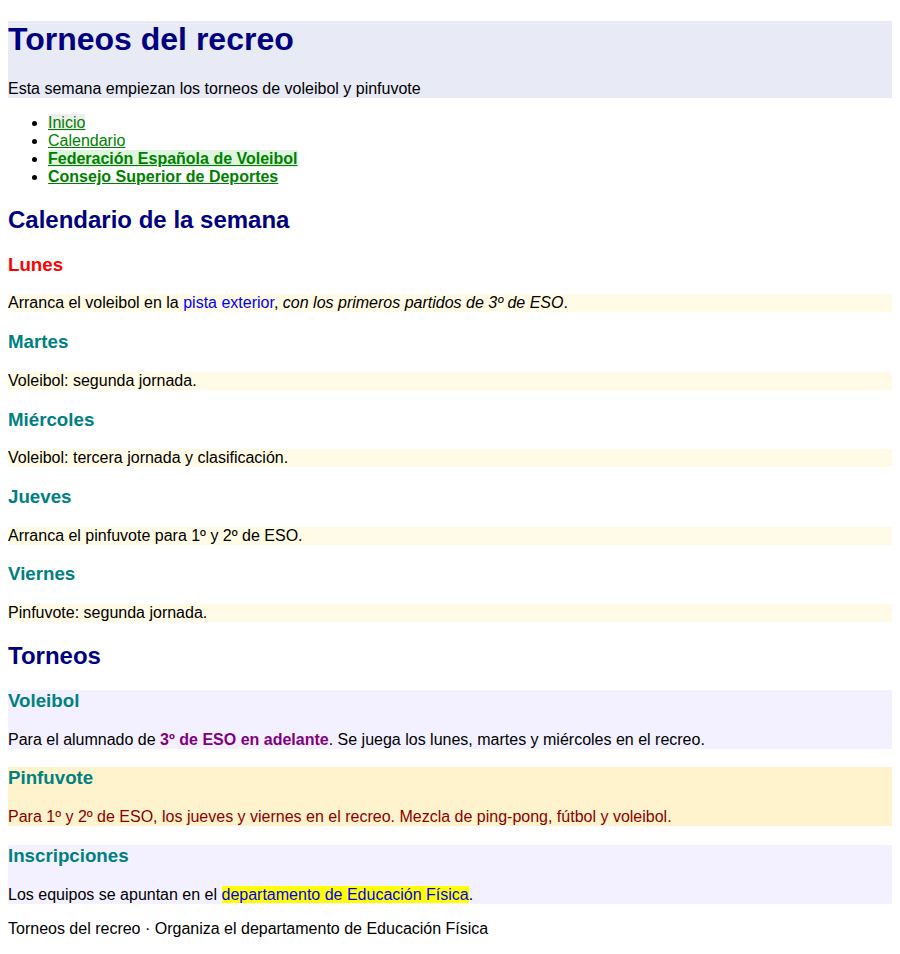

# Guion del ejemplo en directo: selectores CSS («Torneos del recreo»)

> **Documento interno del profesor.** Va en `recursos/ut1-html-css-js/`. Todas las respuestas esperadas se han comprobado en el navegador aplicando los pasos uno a uno.

## Resumen

| | |
|---|---|
| **Qué es** | La página de los torneos del recreo que empiezan esta semana (voleibol para 3º de ESO en adelante, lunes a miércoles; pinfuvote para 1º y 2º de ESO, jueves y viernes), con el HTML ya hecho, a la que se le añade una regla CSS por cada tipo de selector, en el orden de `css.md`. |
| **Duración** | 2 sesiones: ~25 min de demo en la sesión 1 (bloques 1 y 2) y ~30 min en la sesión 2 (bloques 3 a 6). El resto, ejercicios 2, 3 y 4 de `practicas-css.md`. |
| **Dónde** | Repositorio `demo-profesor`, carpeta `ejercicios-css/demo-selectores/` (`index.html` + `css/estilos.css`). Un *commit* por bloque. |
| **Pantalla** | VS Code a la izquierda y el navegador con Live Server a la derecha, ambos visibles en el proyector. |
| **Propiedades usadas** | Solo `color`, `background-color`, `font-weight` y `font-family`, para que la atención esté en los selectores. |

### Antes de clase

1. En `demo-profesor`, crea `ejercicios-css/demo-selectores/` con el `index.html` de este guion y un `css/estilos.css` **vacío**.
2. Ábrelo con Live Server y comprueba que la página se ve sin estilos.
3. Haz *commit* («Demo selectores: HTML de partida») y *push*, para tener un punto de partida al que volver.

### Ritmo de cada paso

1. Escribe el selector y las llaves, **sin guardar**.
2. Pregunta: «¿Qué creéis que va a cambiar?». Deja que respondan.
3. Guarda (`Ctrl + S`). Live Server recarga.
4. Comentad si acertaron. Las «trampas» marcadas con ⚠️ son las predicciones que suelen fallar.

---

## HTML de partida

Cada parte del HTML está pensada para un paso concreto: el `span` dentro de `em` para el paso 8, el `h3` justo después del primer `h2` para el 9, el enlace a `#calendario` (que **no** es `href="#"`) para el 14, y el `id="pinfuvote"` sobre un `article` que ya tiene clase para el cierre.

```html
<!DOCTYPE html>
<html lang="es">
<head>
  <meta charset="UTF-8">
  <meta name="viewport" content="width=device-width, initial-scale=1.0">
  <title>Torneos del recreo — Voleibol y pinfuvote</title>
  <link rel="stylesheet" href="css/estilos.css">
</head>
<body>
  <header id="cabecera">
    <h1>Torneos del recreo</h1>
    <p>Esta semana empiezan los torneos de voleibol y pinfuvote</p>
  </header>

  <nav>
    <ul>
      <li><a href="#">Inicio</a></li>
      <li><a href="#calendario">Calendario</a></li>
      <li><a href="https://www.rfevb.com/" target="_blank" class="externo recomendado">Federación Española de Voleibol</a></li>
      <li><a href="https://www.csd.gob.es/" target="_blank" class="externo">Consejo Superior de Deportes</a></li>
    </ul>
  </nav>

  <main>
    <h2 id="calendario">Calendario de la semana</h2>
    <h3>Lunes</h3>
    <p>Arranca el voleibol en la <span>pista exterior</span>, <em>con <span>los primeros partidos de 3º de ESO</span></em>.</p>
    <h3>Martes</h3>
    <p>Voleibol: segunda jornada.</p>
    <h3>Miércoles</h3>
    <p>Voleibol: tercera jornada y clasificación.</p>
    <h3>Jueves</h3>
    <p>Arranca el pinfuvote para 1º y 2º de ESO.</p>
    <h3>Viernes</h3>
    <p>Pinfuvote: segunda jornada.</p>

    <section>
      <h2>Torneos</h2>
      <article class="torneo">
        <h3>Voleibol</h3>
        <p>Para el alumnado de <span class="destacado">3º de ESO en adelante</span>. Se juega los lunes, martes y miércoles en el recreo.</p>
      </article>
      <article class="torneo novedad" id="pinfuvote">
        <h3>Pinfuvote</h3>
        <p>Para 1º y 2º de ESO, los jueves y viernes en el recreo. Mezcla de ping-pong, fútbol y voleibol.</p>
      </article>
      <article class="torneo aviso">
        <h3>Inscripciones</h3>
        <p>Los equipos se apuntan en el <span class="especial">departamento de Educación Física</span>.</p>
      </article>
    </section>
  </main>

  <footer>
    <p>Torneos del recreo · Organiza el departamento de Educación Física</p>
  </footer>
</body>
</html>
```

> Antes de empezar con el CSS, dedica un minuto a recorrer el HTML con la clase: dónde hay clases, dónde hay `id` y qué `span` hay. Sin ese mapa mental, las predicciones son a ciegas.

---

## Sesión 1

### Bloque 1 — Selectores básicos (~12 min)

**Paso 1 · Universal**

```css
* {
  font-family: Arial, sans-serif;
}
```

- **Pregunta:** ¿qué elementos cambian?
- **Resultado:** todo el texto de la página, incluidos el menú y el pie.
- **Comentario:** `*` llega a todos los elementos. Por eso no se usa para colores: pisaría la herencia de todo.

**Paso 2 · De tipo**

```css
h3 {
  color: teal;
}
```

- **Pregunta:** ¿cuántos títulos cambian?
- **Resultado:** los **ocho** `h3`: los cinco días del calendario y los tres títulos de los torneos.
- **Comentario:** el selector de tipo no distingue dónde está el elemento: los coge todos.

**Paso 3 · Unión**

```css
h1, h2 {
  color: navy;
}
```

- **Resultado:** «Torneos del recreo», «Calendario de la semana» y «Torneos» en azul marino.
- **Comentario:** la coma es «y también». Equivale a escribir dos reglas iguales.

**Paso 4 · De clase**

```css
.torneo {
  background-color: #f3f0ff;
}
```

- **Resultado:** los tres `article` de torneos con fondo lila claro.
- **Comentario:** una clase se puede repetir en tantos elementos como queramos.

**Paso 5 · Segunda clase en el mismo elemento**

```css
.novedad {
  color: darkred;
}
```

- **Pregunta:** ⚠️ el `article` de «Pinfuvote» tiene `class="torneo novedad"`. ¿Qué parte se pone roja?
- **Resultado:** solo el **párrafo**. El título «Pinfuvote» sigue en verde azulado. Además, el fondo lila del paso 4 se mantiene: el elemento recibe los estilos de las dos clases.
- **Comentario:** el `h3` no hereda el rojo porque ya tiene su propia regla (`h3 { color: teal; }`). La herencia solo actúa cuando el elemento no tiene nada propio para esa propiedad.

**Paso 6 · De id**

```css
#cabecera {
  background-color: #e8eaf6;
}
```

- **Resultado:** la cabecera (título y subtítulo) con fondo gris azulado.
- **Comentario:** un `id` es único en la página; si el estilo se va a repetir, mejor una clase.

**❌ Error provocado A — el punto en el HTML**

En el HTML, cambia el primer `<article class="torneo">` por `<article class=".torneo">` y guarda.

- **Pregunta:** ¿por qué ha perdido el fondo?
- **Resultado:** el torneo de voleibol se queda sin fondo lila.
- **Explicación:** el `.` y el `#` solo se escriben en el CSS. Deshaz el cambio.

> **Commit:** «Demo selectores: selectores básicos».

### Bloque 2 — Selectores de relación (~13 min)

**Paso 7 · Descendiente**

```css
p span {
  color: blue;
}
```

- **Pregunta:** ¿cuántos textos se ponen azules?
- **Resultado:** **cuatro**: «pista exterior», «los primeros partidos de 3º de ESO», «3º de ESO en adelante» y «departamento de Educación Física».
- **Comentario:** el espacio significa «dentro de, a cualquier profundidad».

**Paso 8 · Hijo directo** (modifica la regla anterior, no escribas otra)

```css
p > span {
  color: blue;
}
```

- **Pregunta:** ⚠️ ¿cambia algo?
- **Resultado:** «los primeros partidos de 3º de ESO» **deja de ser azul**.
- **Explicación:** ese `span` está dentro de `<em>`, que está dentro del `<p>`. Es nieto del párrafo, no hijo. Señálalo en el HTML.

**Paso 9 · Hermano adyacente**

```css
h2 + h3 {
  color: red;
}
```

- **Pregunta:** ⚠️ hay ocho `h3`. ¿Cuántos se ponen rojos?
- **Resultado:** **solo «Lunes»**, el único `h3` que va justo detrás de un `h2`. Después de «Torneos» va un `article`, no un `h3`.
- **Comentario:** además, gana al `h3 { color: teal; }` del paso 2, porque es más específico (dos etiquetas frente a una).

**Paso 10 · Hermanos en general**

```css
h2 ~ p {
  background-color: #fffbe6;
}
```

- **Pregunta:** ⚠️ ¿se colorean también los párrafos de los torneos?
- **Resultado:** solo los cinco párrafos del calendario (de lunes a viernes). Los de los torneos **no**, porque están dentro de un `article`: no son hermanos del `h2`.

> **Commit:** «Demo selectores: selectores de relación».
>
> **Al terminar:** ejercicios 2 y 3 de `practicas-css.md`.

---

## Sesión 2

Abre la página con el CSS de la sesión anterior y haz un repaso de dos minutos. Por ejemplo: «¿por qué “los primeros partidos de 3º de ESO” no es azul?».

### Bloque 3 — Combinación de selectores (~7 min)

**Paso 11 · Etiqueta + clase**

```css
span.destacado {
  color: purple;
  font-weight: bold;
}
```

- **Pregunta:** «3º de ESO en adelante» ya era azul por `p > span`. ¿De qué color sale ahora?
- **Resultado:** morado y en negrita.
- **Comentario:** `span.destacado` tiene una clase, así que es más específico que `p > span`, que solo tiene etiquetas.

**Paso 12 · Clase dentro de clase**

```css
.aviso .especial {
  background-color: yellow;
}
```

- **Resultado:** «departamento de Educación Física» con fondo amarillo. Sigue en azul, porque `p > span` le sigue dando el color.
- **Comentario:** lee el selector de derecha a izquierda: «algo con clase `especial` que esté dentro de algo con clase `aviso`».

**❌ Error provocado B — el espacio**

Cambia `span.destacado` por `span .destacado` (con un espacio) y guarda.

- **Resultado:** «3º de ESO en adelante» vuelve a azul y pierde la negrita.
- **Explicación:** con espacio, el selector busca algo con clase `destacado` **dentro** de un `span`, y no hay ninguno. Quita el espacio.

> **Commit:** «Demo selectores: combinación».

### Bloque 4 — Selectores de atributo (~8 min)

**Paso 13 · `[atributo]`**

```css
a[target] {
  font-weight: bold;
}
```

- **Resultado:** «Federación Española de Voleibol» y «Consejo Superior de Deportes» en negrita, los dos que se abren en otra pestaña. No se ha tocado el HTML.

**Paso 14 · `[atributo="valor"]`**

```css
a[href="#"] {
  background-color: #eeeeee;
}
```

- **Pregunta:** ⚠️ «Inicio» y «Calendario» son enlaces internos. ¿Cuál se pone gris?
- **Resultado:** **solo «Inicio»**. El `href` de «Calendario» es `#calendario`, no `#`, y el `=` exige el valor exacto.

**Paso 15 · `[atributo~="valor"]`**

```css
a[class~="recomendado"] {
  background-color: #dff5df;
}
```

- **Resultado:** solo «Federación Española de Voleibol» con fondo verde claro.
- **Comentario:** su `class` es `"externo recomendado"`. Con `~=` basta con que **una** de las palabras coincida. Prueba a cambiarlo a `=` y verás que deja de funcionar.

> **Commit:** «Demo selectores: atributo».

### Bloque 5 — Pseudoclases (~8 min)

**Paso 16 · Estados de los enlaces**, escritos **después** de los selectores de atributo:

```css
a:link {
  color: green;
}

a:visited {
  color: purple;
}

a:hover {
  color: white;
  background-color: #1a237e;
}

a:active {
  color: orange;
}
```

- **Resultado:** los cuatro enlaces en verde. Al pasar el ratón, cada uno se vuelve blanco sobre azul oscuro. Mientras mantienes pulsado, naranja. Abre «Consejo Superior de Deportes», vuelve a la pestaña de la demo y ese enlace estará en morado (visitado).
- **Comentario:** el orden importa. Truco para recordarlo: **L**o**V**e **HA**te (*link, visited, hover, active*).

**❌ Error provocado C — falta un `;`**

En `a:hover`, borra el `;` de `color: white;` y guarda. Pasa el ratón por los enlaces.

- **Resultado:** el `:hover` deja de hacer nada: ni texto blanco ni fondo azul.
- **Explicación:** sin el `;`, el navegador lee `color: white background-color: #1a237e`. No es un valor válido, así que descarta toda la declaración. Vuelve a poner el `;`.

**❌ Error provocado D (opcional) — orden de las pseudoclases**

Mueve el bloque `a:hover` **encima** de `a:visited`.

- **Resultado:** al pasar el ratón por «Consejo Superior de Deportes» (ya visitado), el texto sigue morado en lugar de blanco.
- **Explicación:** `:visited` está más abajo y tiene la misma especificidad, así que gana. Devuelve el orden.

> **Commit:** «Demo selectores: pseudoclases».

### Bloque 6 — Cierre: ¿qué regla gana? (~7 min)

**Paso 17 · Un `id` frente a una clase**

```css
#pinfuvote {
  background-color: #fff3cd;
}
```

- **Pregunta:** «Pinfuvote» tiene fondo lila por `.torneo`. ¿Qué pasa ahora?
- **Resultado:** su fondo pasa a amarillo claro. Los otros dos torneos siguen lilas.
- **En el navegador:** pulsa **F12**, selecciona ese `article` y enseña la pestaña de estilos: `#pinfuvote` arriba y la regla `.torneo` con su `background-color` **tachado**. Es la forma de averiguar por qué «algo no se aplica».

**Paso extra · Misma especificidad: gana la última** (probar y borrar)

Añade al final del archivo:

```css
h3 {
  color: green;
}
```

- **Resultado:** todos los `h3` se ponen verdes, porque es la última regla y empata con `h3 { color: teal; }`. **Excepto «Lunes»**, que sigue rojo: `h2 + h3` es más específico.
- **Conclusión para la pizarra:**
  1. Gana la regla **más específica**: en línea > id > clase/atributo/pseudoclase > etiqueta.
  2. Si empatan, gana la que esté **más abajo**.

Borra la regla extra.

> **Commit:** «Demo selectores: especificidad». Haz *push* y enseña el historial de *commits* en github.com: queda un paso a paso que el alumnado puede consultar.
>
> **Al terminar:** ejercicio 4 de `practicas-css.md`.

---

## `css/estilos.css` final

Así queda la hoja al terminar las dos sesiones, con los bloques separados por comentarios, sin los errores provocados y sin el paso extra.

```css
/* Torneos del recreo — ejemplo en directo de selectores CSS */

/* ---------- 1. Selectores básicos ---------- */

* {
  font-family: Arial, sans-serif;
}

h3 {
  color: teal;
}

h1, h2 {
  color: navy;
}

.torneo {
  background-color: #f3f0ff;
}

.novedad {
  color: darkred;
}

#cabecera {
  background-color: #e8eaf6;
}

/* ---------- 2. Selectores de relación ---------- */

p > span {
  color: blue;
}

h2 + h3 {
  color: red;
}

h2 ~ p {
  background-color: #fffbe6;
}

/* ---------- 3. Combinación de selectores ---------- */

span.destacado {
  color: purple;
  font-weight: bold;
}

.aviso .especial {
  background-color: yellow;
}

/* ---------- 4. Selectores de atributo (antes que las pseudoclases) ---------- */

a[target] {
  font-weight: bold;
}

a[href="#"] {
  background-color: #eeeeee;
}

a[class~="recomendado"] {
  background-color: #dff5df;
}

/* ---------- 5. Pseudoclases de enlaces (orden: link, visited, hover, active) ---------- */

a:link {
  color: green;
}

a:visited {
  color: purple;
}

a:hover {
  color: white;
  background-color: #1a237e;
}

a:active {
  color: orange;
}

/* ---------- 6. Cierre: especificidad (un id gana a una clase) ---------- */

#pinfuvote {
  background-color: #fff3cd;
}
```

## Resultado final



## Si algo se tuerce en directo

- **No cambia nada al guardar:** comprueba que Live Server está abierto sobre `demo-selectores/index.html` y que el `<link>` apunta a `css/estilos.css`.
- **Una regla no hace lo que dice el guion:** abre F12 y mira si aparece tachada. Lo más probable es una regla anterior más específica o un `;` olvidado. Aprovéchalo como un error provocado más.
- **Hay que volver atrás:** cada bloque tiene su *commit*. En VS Code, panel Source Control → *Discard Changes* para volver al último.
